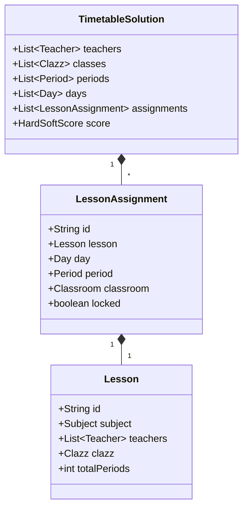
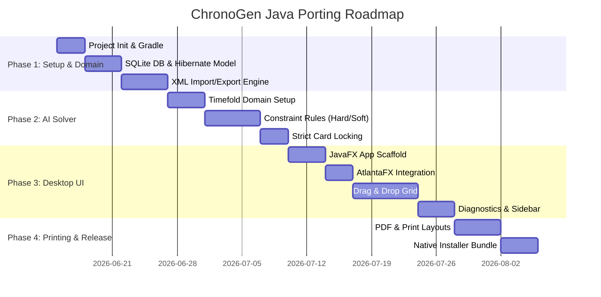

# Blueprint & To-Do: ChronoGen Java Standalone Desktop Application

This document outlines the architectural design, technology stack, solver model, and step-by-step roadmap for porting **ChronoGen** into a modern, standalone desktop application.

---

## 1. Technology Stack

A modern standalone Java desktop application should look polished and run efficiently without requiring users to pre-install runtime environments.

*   **Language & Runtime**: **Java 21 (LTS)**
    *   Leverages virtual threads (Loom) for non-blocking solver runs and UI responsiveness.
    *   Uses Java Records for immutable data transfer objects (DTOs).
*   **UI Framework**: **JavaFX 21** + **AtlantaFX** (CSS Theme Library)
    *   **AtlantaFX** provides modern, high-contrast themes (e.g., Primer Dark/Light, Nord, Dracula) that mimic CSS framework aesthetics.
    *   Fully supports CSS styling, layouts, DPI scaling, and smooth animations.
*   **AI Solver Engine**: **Timefold Solver** (the leading open-source branch of OptaPlanner)
    *   An industry-standard engine for solving vehicle routing, employee rostering, and school timetabling problems.
    *   Implements Tabu Search, Simulated Annealing, and Late Acceptance Hill Climbing.
*   **Local Persistence**: **SQLite** + **Hibernate ORM** (JPA)
    *   Lightweight, serverless SQL database stored as a single local file.
*   **Packaging & Distribution**: **Gradle** + **jpackage** (Badass Runtime Plugin)
    *   Packages the Java application and a stripped-down JVM (via `jlink`) into a single native installer (`.exe` for Windows, `.dmg` for macOS, `.deb`/`.rpm` for Linux).

---

## 2. Solver Architecture (Timefold Model)

Using Timefold, we translate timetabling into a Constraint Satisfaction Problem (CSP).

### Key Timefold Components:
1.  **Planning Entity (`LessonAssignment`)**:
    *   Represents a 1-period slot for a lesson card.
    *   `day`, `period`, and `classroom` are marked as `@PlanningVariable` (variables the solver changes).
    *   **Strict Card Locking**: If a card is locked, it is annotated with `@PlanningPin`. Timefold respects `@PlanningPin` strictly: it freezes the variable values on that entity, preventing the solver from changing or bumping it.
2.  **Planning Solution (`TimetableSolution`)**:
    *   Holds all entities, domain lists, and the solver score.
3.  **Constraint Provider (`TimetableConstraintProvider`)**:
    *   Defines hard and soft constraints using Timefold's ConstraintStreams API (which runs incrementally for speed).

### Constraint Definitions (Java DSL):

#### Hard Constraints (Must not violate):
*   **Room/Classroom Conflict**: Prevent two classes from booking the same room at the same day/period.
*   **Teacher Conflict (Double-booking)**: A teacher cannot teach two lessons simultaneously.
*   **Class Conflict**: A class cannot have two lessons at the same time.
*   **Time-off Hard Blocks**: Prevent placements in slots marked as unavailable (locked/time-off) for teachers or classes.

#### Soft Constraints (Minimize/Maximize):
*   **Minimize Teacher Gaps**: Avoid "holes" in a teacher's day (e.g., teach period 1, free period 2, teach period 3).
*   **Max Consecutive Hours Overrides**: Penalize if a teacher teaches more than $N$ consecutive periods.
*   **Teacher Preferences**: Reward scheduling lessons in slots marked "Prefer" and penalize slots marked "Avoid".
*   **Uniform Class Distribution**: Distribute subjects evenly across the week.

---

## 3. Core Feature Implementations

### A. aSc XML Import/Export
*   Use Java's standard XML libraries (Jackson XML or JAXB) to map elements (`<teachers>`, `<classes>`, `<lessons>`, `<cards>`, `<timeoffs>`).
*   Support exporting clean XML files fully compatible with the official aSc Timetables desktop app.

### B. High-Fidelity Printing & PDF
*   Use **OpenPDF** or **Apache PDFBox** for document generation.
*   Implement layout templates:
    *   *Master Grid*: Large-format matrix (A3/A4 Landscape).
    *   *Individual Cards*: Individual schedules printable for each teacher and class.
*   Retain the "Auto-Scale to Page" logic: programmatically calculate column widths and font sizes until the table bounds fit exactly within the PDF printable area.

### C. UI/UX: Interactive JavaFX Grid
*   Use JavaFX's native Drag and Drop API (`OnDragDetected`, `OnDragOver`, `OnDragDropped`).
*   On `DragOver`, query a quick evaluation check (running the local constraint validator) to highlight target cells:
    *   **Green**: No conflict.
    *   **Orange**: Violates soft rules (e.g., teacher preferences).
    *   **Red**: Violates hard rules (locked card, time-off, or double booking).

---

## 4. Porting Roadmap

### Next Steps:
1.  Initialize a Gradle project with JavaFX, Timefold, and Hibernate.
2.  Define the database tables (SQLite) for schools, teachers, classes, subjects, rooms, and assignments.
3.  Write the XML parsing layer (`xmlParser.js` equivalent in Java).
